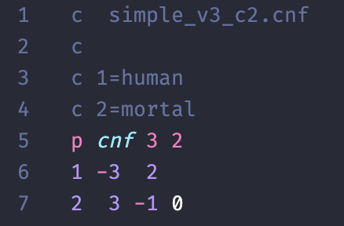

# 🎛 DIMACS Language Support for VS Code

[DIMACS CNF](https://jix.github.io/varisat/manual/0.2.0/formats/dimacs.html) is a standard format for representing boolean formulas in conjunctive normal form.

This extension provides syntax highlighting for `.cnf` files using the DIMACS CNF format.

## Contributing

The files that are used to define the language are below:

- `syntaxes/dimacs.tmLanguage.json` - the Text mate grammar file that is used for tokenization.
- `language-configuration.json` - the language configuration, defining the tokens that are used for comments and brackets.

To test, press `F5` when editing the extension with VS Code to open a new window with the extension loaded.
